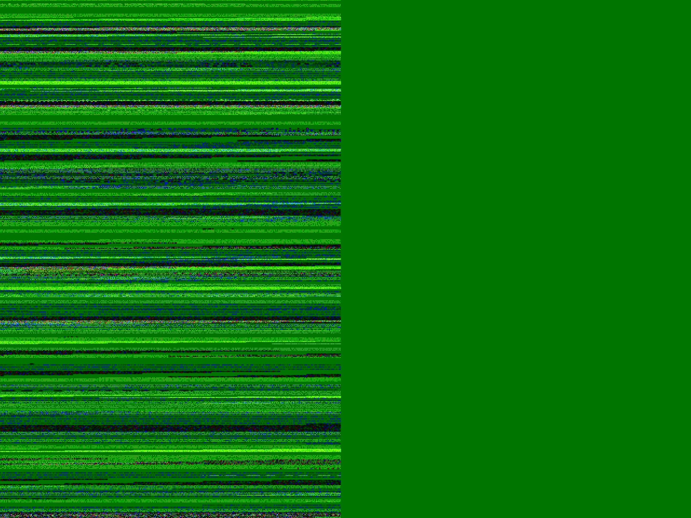

#  iOS 14 Photo Capture Glitch

iOS 14 has introduced a glitch when capturing high resolution photos from the front camera in certain circumstances, on certain devices only. The issue does not occur when using an `AVCaptureVideoPreviewLayer` to preview the camera, but when there is no preview or when using `AVCaptureVideoDataOutputSampleBufferDelegate` for the preview, the photo capture produces a glitched result sometimes.  

It seems to happen more in low light conditions, in brighter environments the photos come out as expected. If the environment isn't too bright, even covering the camera with your hand at a distance of about 5 to 10 cm causes the issue. Covering the camera completely with an opaque, dark object will reproduce the issue most of the time.

I could not reproduce the issue when using the back camera, only the front camera. The issue also only occurs when capturing at the full camera resolution (using `isHighResolutionCaptureEnabled` along with `AVCaptureSession.Preset.photo`). Lowering the resolution does not reproduce the issue.

## Affected Devices

The only devices I've been able to reproduces it on are the 9.7" iPad Pro models (`iPad6,3 A1673` and `iPad6,4 A1674`). I have not tested on all other iPad models, but we have confirmed that various other iPad Pro and iPad Air models, and a few iPhone models do not suffer from the issue. 

## Running the Project

To reproduce the result, you will need to run the project on one of the affected devices. To run on a device, you will first need to set a development team for the app target (you may also need to choose a unique bundle identifier).

1. When the app launches, it will show a list of different preview options. Choose from one of the preview options in the list presented. 
2. Press the capture button to to capture an image and display it at the top right corner. 
3. When capturing using one of the affected preview methods, if the environment is not well lit enough, the photo output will be glitched similar to the example glitched output image below.

## Things I Tried

### Capturing with a different API

This project is currently using the iOS 11 API for capturing the image, with an  `AVCapturePhotoOutput` and the `photoOutput(:didFinishProcessingPhoto:error:)` delegate callback. Using deprecated APIs such as the `photoOutput(:didFinishProcessingPhoto:previewPhoto:resolvedSettings:bracketSettings:error:)` delegate callback, or the older `AVCaptureStillImageOutput` API have the same issue.

### Capturing with a different pixel format

I tried all the pixel formats supported by the affected devices, and all produced the same results with the glitched output. Supported pixel formats tried were:

- `kCVPixelFormatType_420YpCbCr8BiPlanarFullRange`
- `kCVPixelFormatType_420YpCbCr8BiPlanarVideoRange`
- `kCVPixelFormatType_32BGRA`

### Using different pixel formats for the `AVCaptureVideoDataOutput`

All supported pixel formats used by the video output also produce the glitched effect. I tried all the formats listed above.

## Example Glitched Output

When the photo capture glitch occurs, this is an example of what it looks like. This was saved right from the preview of the pixel buffer when paused in Xcode, using the debugger quick look feature.

